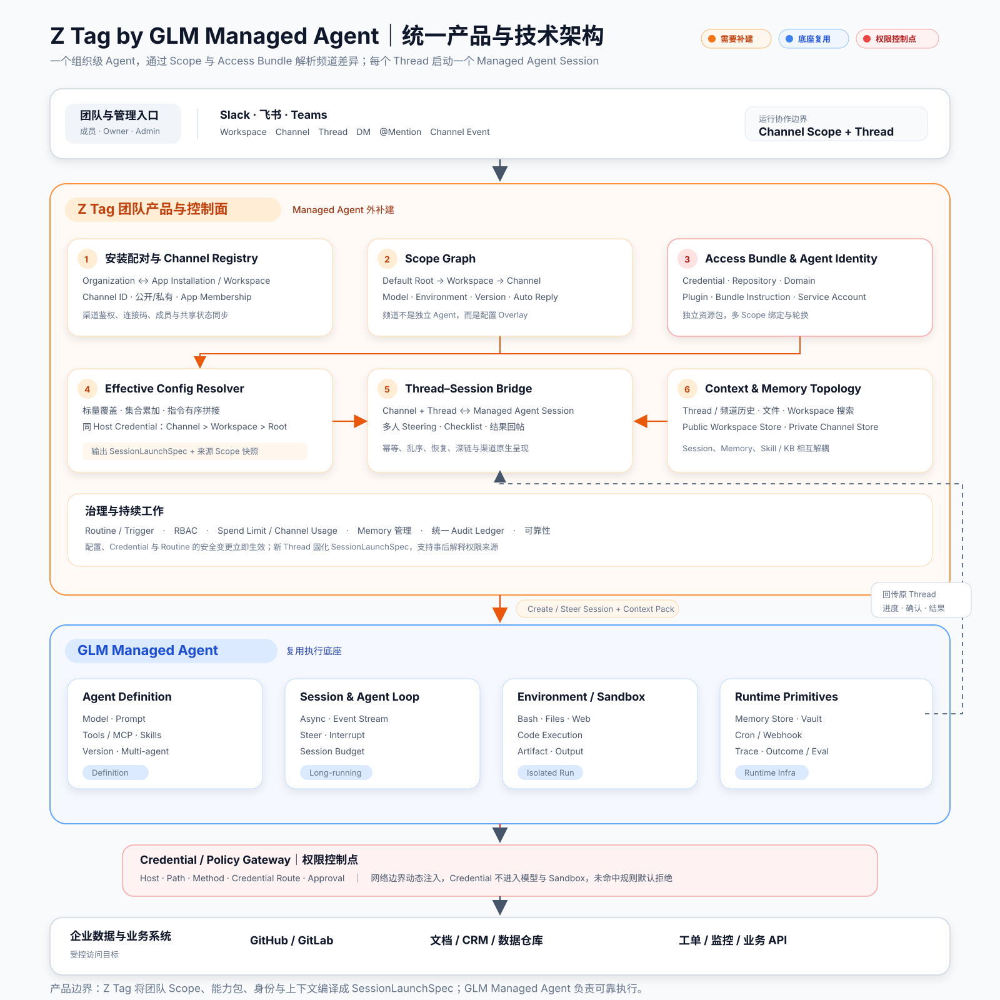

# Z Tag by Managed Agent

基于 Claude Tag 官方资料、42 张真实产品截图、新增 UI Atlas 与 Claude Managed Agents 的公开信息，拆解团队级 Agent 产品，并给出以 GLM Managed Agent 为执行底座的产品与技术架构方案。

> 核心结论：Claude Tag 不是“每频道一个 Agent”，而是“一个组织级 Agent + Scope Graph + Access Bundle + 每 Thread 一个 Session”。预算、Memory、Routine 与只读 Session Trace 各自有独立边界，不能全部塞进 Scope。GLM Managed Agent 负责把任务做完；Z Tag 负责把频道、配置、身份权限和团队治理编译成可执行的 Session。

## 截图复核后的关键对象

```text
Default Slack access → Workspace Scope → Channel Scope → Thread Session
          \________________ Access Bundle 多对多挂载 ________________/
```

- Scope：决定频道的模型、环境、版本、指令、自动动作规则等。
- Access Bundle：组合 Credentials、Repositories、Domains、Plugins、Instructions，并向下累加。
- Effective Config：对不同字段分别执行覆盖、累加、拼接和 Credential 冲突优先级。
- Memory：使用独立拓扑；公共频道共享 Workspace Store，私有频道只读公共记忆、写私有 Store。
- Interaction Policy：`@Mention` 保证回复；频道可开启 Ambient 自动回复；Thread 内回复继续原 Session。
- Budget：单独使用组织总限额、默认频道限额与单频道限额，不存在已确认的 Workspace Budget。
- Session Trace：`Open session in Claude` 是只读运行记录；继续指导必须回到原 Slack Thread。

## 统一架构图



图中颜色含义：

- 橙色：对标 Claude Tag，Z Tag 需要在 Managed Agent 之外补建的团队产品能力。
- 蓝色：GLM Managed Agent 可复用的执行底座。
- 红色：权限、凭证与敏感操作控制。
- 灰色：渠道入口与企业外部系统。

可编辑的 Mermaid 源文件见 [`diagrams/unified-architecture.mmd`](diagrams/unified-architecture.mmd)。

## 文档导航

| 文档 | 内容 |
|---|---|
| [Claude Tag 深度拆解](docs/claude-tag-research.md) | 完整配置流程、真实对象模型、频道差异化规则、产品/技术架构与边界 |
| [GLM Z Tag 构建方案](docs/glm-z-tag-architecture.md) | Scope Resolver、Access Bundle、SessionLaunchSpec、补建模块与分期 |
| [Claude Tag 真实产品截图](docs/claude-tag-screenshots.md) | 42 张截图的逐步解读与每组截图对应的架构含义 |
| [Claude Tag UI Atlas（证据复核版）](docs/claude-tag-ui-atlas.md) | UI 清单、官方复核结论与被排除的过度推断 |
| [Claude Tag 三方解读](docs/claude-tag-third-party-analysis.md) | 13 张分析图中可采纳、可参考和不能当作事实的部分 |
| [官方资料索引](docs/sources.md) | Claude Tag 与 Claude Managed Agents 的官方资料链接 |

## 研究边界

- "官方事实"来自 Anthropic/Claude 公开资料；链接集中在资料索引中。
- "截图事实"仅用于确认录制当时的界面、字段、步骤和状态。
- YouTuber 的内部技术推演只作为假设，不作为 Anthropic 实现证据。
- "建议方案"是面向 GLM Managed Agent 的产品与技术设计，不代表 Anthropic 已公开的内部实现。
- Claude Tag 与 Claude Managed Agents 是两个独立产品。不能仅因能力相似，就断言 Claude Tag 底层直接调用公开的 Managed Agents API。
- 本仓库研究快照日期：2026-08-12。
