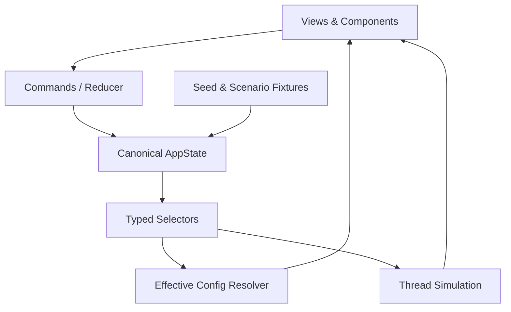
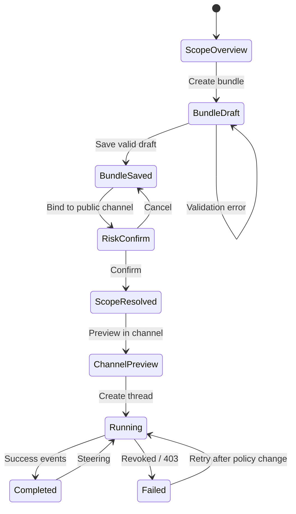

# Z Tag 配置 Demo 技术方案

> 状态：v0.7，最终独立复审通过（P0=0、P1=0），Demo 已完成构建、浏览器验收与发布。基线为 [`demo-product-plan.md`](demo-product-plan.md)。

## 1. 技术目标

首版交付一个单路由、纯前端、有状态的桌面 Web Demo。它不调用真实 LLM、Credential、GitHub 或 Channel API，但必须真实运行三类核心逻辑：

1. Scope / Bundle / Binding 的状态变化。
2. Effective Config Resolver 与 Provenance / Diff 计算。
3. Thread 启动快照与按请求实时执行的 Live access policy。

Demo 不是一组可点击的静态页面。主流程中的创建、保存、绑定、风险确认、覆盖解析、Thread 启动、Steering、成功/403 结果都由同一份前端状态驱动。

## 2. 实现边界

### 首版实现

- 单路由 React + TypeScript 应用。
- Owner 主视角；Admin / Channel member 作为边界预览，不做完整角色切换系统。实现只读 `ActorContext` fixture 与 `canEditChannelInstructions(actor, effectiveMemberEdits)` 纯函数；只有 `isOrgMember && isChannelMember && effectiveMemberEdits === 'allow'` 才返回 true。测试覆盖 2×2×allow/block 真值表。
- Default → Workspace → Channel 三层 Scope。
- 全局 Access Bundle Library、未绑定 Bundle 创建、Channel binding。
- Credentials、Repositories、Domains、Plugins、Instructions 五个 Bundle Tab。
- Connection Host / Path prefix / Method 表单与 Policy Preview。
- Effective Access、来源链路和本次变更 Diff。
- Public Channel elevated Bundle 风险确认。
- Channel Preview、Session snapshot、Live access policy、多人 Steering、只读 Trace。
- 可触发的冲突、Credential revoked、403/no-fallback、空状态和加载失败。

### 首版不实现

- 真实 OAuth、Slack / 飞书事件、Managed Agent、LLM、GitHub、Ticket API。
- Secret 持久化、Vault、Proxy、Sandbox、真实网络请求。
- 后端、数据库、登录、多人实时同步。
- Memory、Routine、Audit、Usage 的完整逻辑；仅提供边界清晰的只读预览。
- DM、Personal Connector、多 Agent Definition、Requester Overlay、JIT Credential。

## 3. 技术栈

| 层 | 选择 | 原因 |
|---|---|---|
| Runtime | Vinext + React + TypeScript | 采用当前 Sites Vinext starter；使用其既有 Vite 开发/构建链，不另建通用 Vite App |
| UI | 原生 React 组件 + CSS variables | 首版视觉高度定制，避免引入沉重组件库 |
| Icons | Phosphor Icons 或与参考截图更接近的现成图标库 | 不手绘 SVG，不用 emoji / 文本符号代替界面图标 |
| State | `useReducer` + typed selectors | 状态规模有限，但需要可追踪事件与确定性重放 |
| Validation | 纯函数 schema validator | 避免为少量表单引入完整后端校验框架 |
| Tests | Vitest + React Testing Library；关键流程浏览器验证 | Resolver 和状态机用单测，主链路用交互验证 |
| Persistence | 无 | 每次刷新恢复 seed；避免误导为真实配置系统 |

不引入 Zustand、Redux、Router、数据库或 API client。首版只有一个主路由，左侧导航切换的是内部 View，不是多页应用。

## 4. 前端分层



### 4.1 Views & Components

- 只负责渲染、输入、焦点、键盘和可访问性。
- 不在组件内部重复实现继承或权限规则。
- Scope detail 作为 Access & scopes 的右侧面板。
- Bundle editor 使用大尺寸 Dialog；Connection editor 为 Dialog 内的二级 panel，不再叠第三层模态框。

### 4.2 Commands / Reducer

所有主流程变化通过显式事件进入 reducer，例如：

```text
CREATE_BUNDLE_DRAFT
UPSERT_CONNECTION_SANS_SECRET
SAVE_BUNDLE
REQUEST_SCOPE_BINDING
CONFIRM_RISK_AND_BIND
CREATE_THREAD
STEER_THREAD
REVOKE_CREDENTIAL
RUN_LIVE_POLICY_CHECK
RESET_DEMO
```

这样既能确定性重放，也能让测试验证“哪一步改变了什么”。所有 action payload 类型从定义上不包含 Secret；不记录 reducer action history。

### 4.3 Resolver 与 Simulation 分开

- Resolver：计算某个 Scope 当前的 Effective Config、Provenance、Conflict 和 Diff。
- Thread Simulation：在 `CREATE_THREAD` 时固化 snapshot，并根据后续 action 查询当前 Live policy。
- 模拟脚本不能直接写死最终 UI；它只能发出事件，UI 始终从 state 读取。

## 5. 数据模型

```ts
type ScopeLevel = 'default' | 'workspace' | 'channel'

type Scope = {
  id: string
  revision: number
  level: ScopeLevel
  parentId?: string
  name: string
  privacy?: 'public' | 'private'
  scalarConfig: {
    tagVersion?: string
    model?: string
    environmentId?: string
    respondAutomatically?: boolean
    channelMemberEdits?: 'inherit' | 'allow' | 'block'
  }
  customInstructions?: string
}

type Connection = {
  id: string
  name: string
  credentialType: 'bearer' | 'basic' | 'body' | 'aws-sigv4' | 'gcp' | 'oauth'
  credentialStatus: 'configured' | 'revoked'
  allowedHosts: string[]
  pathPrefixes: string[]
  methods: Array<'GET' | 'POST' | 'PUT' | 'PATCH' | 'DELETE'>
}

type AccessBundle = {
  id: string
  name: string
  description: string
  connections: Connection[]
  repositories: Array<{
    id: string
    fullName: string
    capabilities: Array<'read' | 'create-branch' | 'open-pr'>
  }>
  domains: Array<{ host: string; ports: number[] }>
  pluginIds: string[]
  instructions?: string
  revision: number
}

type ScopeBundleBinding = {
  id: string
  scopeId: string
  bundleId: string
  position: number       // 只控制稳定展示，不参与 Credential precedence
  createdAt: string
  revision: number
}

type ActorContext = {
  role: 'owner' | 'admin' | 'member'
  isOrgMember: boolean
  isChannelMember: boolean
}

const canEditChannelInstructions = (actor: ActorContext, edits: 'allow' | 'block') =>
  actor.isOrgMember && actor.isChannelMember && edits === 'allow'

type DomainRule = { host: string; ports: number[] }

type EnvironmentNetworkPolicy =
  | { mode: 'deny-all' }
  | { mode: 'allowlist'; domains: DomainRule[] }
  | { mode: 'unrestricted' }

type EnvironmentDefinition = {
  id: string
  name: string
  networkPolicy: EnvironmentNetworkPolicy
}
```

Binding 只有一个事实源：`bindingsById`。Scope 上的 Direct Bundle、Bundle 的 Used in N places 以及全部继承来源均由 selector 派生；不在 Scope 与 Bundle 两侧双写列表。

`(scopeId, bundleId)` 是逻辑唯一键。重复绑定命令幂等返回已有 Binding，不新增记录或 Provenance；同一 Bundle 绑定不同 Scope 合法。实现与测试均不依赖数据库约束。

Environment 定义来自只读 `environmentCatalog` seed，不放入可编辑 `AppState`。Scope 仅保存 `environmentId`；Resolver 按 ID 取定义并把完整 `networkPolicy` 复制进 Session snapshot。未知 ID 视为配置错误，不能创建 Thread。

### 5.1 Secret 处理

`secretDraft` 不进入 `ConnectionDraftSansSecret`、`BundleDraftSansSecret`、reducer action、`AccessBundle`、`AppState`、URL、日志、error、toast、telemetry、Trace 或 browser storage。它只存在于 `ConnectionEditorPanel` 的局部临时状态：

```text
Input secretDraft
→ 点击 Save 时显式构造 ConnectionDraftSansSecret
→ dispatch UPSERT_CONNECTION_SANS_SECRET
→ 领域状态仅写入 credentialStatus = configured
→ 立即清空 secretDraft
→ 后续只显示 Configured / Rotate / Delete
```

刷新页面恢复 seed，不保留任何输入值。测试使用唯一哨兵 Secret，断言序列化后的 action、AppState、snapshot、Summary 与 Trace 均不含该值。

### 5.2 Canonical AppState

```ts
type AppState = {
  scopesById: Record<string, Scope>
  bundlesById: Record<string, AccessBundle>
  bindingsById: Record<string, ScopeBundleBinding>
  selectedScopeId: string
  activeView: 'scopes' | 'bundles' | 'audit' | 'memory' | 'usage' | 'channel'
  draft?: BundleDraftSansSecret
  pendingRisk?: RiskConfirmation
  lastMutation?: {
    scopeId: string
    beforeItems: NormalizedEffectiveItem[]
    beforeHash: string
    mutationId: string
  }
  thread?: SimulatedThread
  simulation: {
    fixtureId: 'success' | 'revoked' | '403-no-fallback' | 'loading-error'
    activeRunId?: string
    credentialStatusOverride?: { runId: string; routeKey: string; status: 'revoked' }
    externalResponseOverride?: { runId: string; status: 401 | 403 }
  }
  loading: {
    effectiveSummary: 'ready' | 'failed'
  }
  ui: {
    demoMode: boolean
    bundleDialogOpen: boolean
    provenanceItemId?: string
    toast?: ToastState
  }
}
```

`lastEffectiveDiff` 不直接存储。Mutation 开始前记录规范化的 `beforeItems`；mutation 完成后 selector 用当前 Resolver 结果计算 Diff。下一次 mutation 会原子替换该记录，避免陈旧 Diff。

## 6. Seed 数据

初始数据固定且可复位：

```text
Default access
└── Zhipu Workspace
    ├── #general
    ├── #agent-platform      ← 当前主故事
    └── #customer-support
```

- `company-docs-readonly` 绑定 Default。
- `engineering-base` 绑定 Workspace：包含 `api.staging.example.com` 的只读 GET Credential 与 Engineering 基础 Plugin。
- `#agent-platform` 初始 0 个 Direct Bundle。
- Seed 的 `bundlesById` 中不包含 `agent-platform-write`。点击 Create 才由 `CREATE_BUNDLE_DRAFT` 生成预填但未保存的 draft；只有 `SAVE_BUNDLE` 后才写入 `bundlesById`，随后才能绑定。Draft 包含同 Host 的 `/tickets/` + GET/POST Connection、目标 Repository、Engineering Workflow Plugin、Bundle Instructions。
- `team-sandbox` Environment 使用 allowlist policy，包含常用 package hosts；`locked-down` 为 deny-all。主故事的 snapshot 固化 `team-sandbox` 完整 policy。

合成外部对象统一使用 `example.com` 与当前公开仓库名；链接点击后显示模拟详情，不打开或调用真实系统。

## 7. Effective Config Resolver

Resolver 是首版最核心的可测试纯函数：

```ts
resolveEffectiveConfig(scopeId, scopesById, bundlesById, bindingsById, environmentCatalog): EffectiveConfig
```

Environment catalog 作为 Resolver / Session compiler 的显式参数传入，不允许领域纯函数隐式读取模块级 seed。

### 7.1 解析步骤

1. 构建 `[Default, Workspace, Channel]` scope chain。
2. 标量配置只以 `value !== undefined` 判断显式值；`false` 是有效配置。`channelMemberEdits = inherit` 继续向父级解析，不作为最终值。保留 overridden provenance。
3. 从唯一的 Binding 表收集 chain 上的所有有效 Binding。Binding 使用 `scope rank → position → bindingId` 稳定排序；`position` 不参与权限优先级。
4. 同一 Bundle 可绑定多个 Scope：能力内容按 `bundleId + revision` 只解析一次，Bundle Instructions 不重复拼接；Provenance 保留全部有效 Binding，并标记最直接来源。
5. Repository / Plugin / Domain 执行稳定去重 union：Repository 用 ID，Plugin 用 ID，Domain 用规范化 Host 并合并 Ports。
6. Scope Custom Instructions 按 Default → Workspace → Channel 单独拼接。
7. Bundle Instructions 保持独立分组，不虚构其与 Scope Instructions 的官方相对顺序。
8. 每个 Connection 先展开成逐 Host `CredentialRoute`，再按规范化 Host 分组：Channel > Workspace > Default；同级同 Host 产生 `same-scope-conflict`。Binding order 不参与 precedence。
9. 为每个 Effective item 生成稳定 Provenance：

```text
Effective item
← Bundle
← Direct / inherited binding
← Source scope
```

10. 返回 conflict、risk 和解释文本，但不修改原 state。

稳定 key：Repository=`repo:{id}`；Plugin=`plugin:{id}`；Domain=`domain:{normalizedHost}`；Credential route=`credential:{normalizedHost}`；Bundle instruction=`bundle-instruction:{bundleId}:{revision}`。

Host 规范化规则唯一：输入必须是 hostname，不允许 scheme、port 或 path；保存时 lowercase、移除尾部 `.`、使用规范化结果参与 stable key 与匹配。非法 Host 在表单层直接拒绝。

### 7.2 Credential 规则

- 跨 Scope 同 Host：narrowest scope wins。
- Connection draft 保存时仅校验 Bundle 内重复 Host 与字段合法性；未绑定 Bundle 不做 Scope 冲突判断。
- Attach Bundle 时，Resolver 预检目标 Scope 的 Direct bindings；同 Scope 的其他 Bundle 提供相同 Host 时，作为 Z Tag enhancement 阻止 binding。
- 编辑已绑定 Bundle 时预检所有 usage scopes；任一 Scope 产生同级同 Host conflict，则原子阻止保存并列出受影响 Scope。
- 跨 Scope 同 Host：合法覆盖，narrowest scope wins。
- winning Credential 为 revoked 或返回 401/403：结果失败，不回退到更宽 Scope Credential。
- 一个 Connection 有多个 Host 时，展开为多个独立 route；每个 Host 单独参与 precedence。
- Path / Method 未命中 winning Host route 时，不注入 Credential，并继续检查当前 Domain rule 与 Session snapshot 中的 Environment policy。
- Domain / Environment 只决定无凭证可达性，不覆盖已经命中的 Connection Credential。
- 编辑已绑定 Bundle 时，在提交前 resolve 它关联的所有 Scope；任一 Scope 出现同级同 Host conflict，整次保存原子失败。

### 7.3 Live request 唯一算法

1. 按 Host 选择最窄 Scope 的当前 Connection route；不回退更宽 Scope Credential。
2. 若 Path / Method 命中：
   - `configured`：注入 winning Credential，执行模拟外部请求。
   - `revoked`：立即失败，不回退。
   - 外部响应为 401 / 403：失败，不回退。
3. 若 Path / Method 未命中：不注入 Credential，检查当前 Domain rule。
4. Domain 未命中：检查该 Thread snapshot 固化的 Environment network policy。
5. 仍未允许：`blocked-default-deny`。

这套顺序是唯一实现；组件、模拟脚本和测试不能各自复制一版判断。

### 7.4 Elevated Bundle

风险门禁按 mutation 分开：

- `isElevatedBundle(bundle)`：Bundle 存在 POST / PUT / PATCH / DELETE Connection，或 Repository capability 含 `create-branch` / `open-pr`；仅在 Public Channel binding 时触发。
- `isRiskyEnvironmentChange(before, after)`：Environment 从非 `unrestricted` 变为 `unrestricted`；仅在保存 Scope Environment 变更时触发。
- 两者不交叉：已有 unrestricted Environment 不会让任意只读 Bundle 被误判 elevated；改变 Environment 也不会绕过门禁。UI 仍只展示“Selected repository”和可执行能力说明，不提供虚构的权限下拉。风险确认由该 selector 驱动，不由按钮文案或 Bundle 名称硬编码。

### 7.5 Diff

绑定前后分别 resolve，使用稳定 key 比较：

```ts
diffEffectiveConfig(before, after): EffectiveDiff
```

输出 `added[]`、`removed[]`、`changed[]`，其中 Credential 变化必须显示 `Workspace → Channel`。

## 8. Thread snapshot 与 Live policy

### 8.1 Session snapshot

`CREATE_THREAD` 时保存：

```ts
type SessionSnapshot = {
  scopeId: string
  scopeVersions: Array<{ id: string; revision: number }>
  bundles: Array<{ id: string; revision: number; name: string }>
  model: string
  environment: { id: string; name: string; networkPolicy: EnvironmentNetworkPolicy }
  repositories: Array<{
    id: string
    fullName: string
    capabilities: Array<'read' | 'create-branch' | 'open-pr'>
  }>
  plugins: Array<{ id: string; name: string }>
  scopeInstructions: ProvenancedInstruction[]
  bundleInstructions: ProvenancedInstruction[]
  createdAt: string
  configHash: string
}
```

之后修改 Scope、Bundle 名称 / revision、Model、Plugin、Instruction、Repository grant 不改变已有 snapshot 的值或展示；UI 不再通过 `bundleId` 回查当前 Bundle 内容。点击 New thread 才重新解析。

### 8.2 Live access policy

每次模拟工具请求都读取当前 Connection / Domain / Credential projection，但 Environment policy 只能来自 Thread snapshot。Evaluator 不允许接收完整 `AppState`：

```ts
const livePolicy = selectCurrentLivePolicy(scopeId, state)

type ScenarioOverrides = {
  activeRunId: string
  credentialStatus?: { runId: string; routeKey: string; status: 'revoked' }
  externalResponse?: { runId: string; status: 401 | 403 }
}

evaluateLiveRequest(
  request, // { host, port = 443, path, method }
  sessionSnapshot.environment.networkPolicy,
  livePolicy,
  scenarioOverrides: ScenarioOverrides
)

`evaluateLiveRequest` 是唯一入口：仅当 override.runId === activeRunId，且 Credential override 的 routeKey 命中 winning route 时才应用；旧 run override 一律忽略。组件和 Runner 不得自行判断 revoked / 401 / 403。
```

`LivePolicyProjection` 类型只包含当前 Connection routes、Domain rules、Credential status 及其 Binding provenance；不包含 Model、Environment、Repo、Plugin 或 Instructions。
`LiveRequest.port` 缺省为 443，并与 Domain / Environment rule 的 Ports 一起参与 allow 判断。`externalResponseOverride` 显式携带 `runId`，不能只依赖相邻的 active run 状态。

返回：

- `credential-match`
- `allowlist-only`
- `blocked-default-deny`
- `revoked`
- `401-no-fallback`
- `403-no-fallback`

因此新增 / 删除 Connection、Domain 或 Binding 会实时影响旧 Thread，Credential revoke 也立即生效；但旧 Thread 的 Environment、Repo、Plugin、Instructions 与 Bundle 名称 / revision 展示保持启动时版本。

## 9. 主流程状态机



离开有未保存 Draft 的 View 时显示确认；Cancel 保留当前页面，Discard 才清空 Draft。

## 10. 页面与组件结构

```text
AppShell
├── GlobalSidebar
├── AccessScopesView
│   ├── ScopeTree
│   └── ScopeDetailPanel
│       ├── EffectiveAccessSummary
│       ├── BundleBindingSection
│       ├── EffectiveDiffBanner
│       └── ProvenanceDrawer
├── BundleLibraryView
│   ├── BundleTable
│   └── BundleEditorDialog
│       ├── CredentialsTab → ConnectionEditorPanel
│       ├── RepositoriesTab
│       ├── DomainsTab
│       ├── PluginsTab
│       └── InstructionsTab
├── ReadOnlyPreviewView
└── ChannelPreviewView
    ├── ChannelHeader
    ├── ThreadTimeline
    ├── ChecklistCard
    ├── ThreadComposer
    ├── SessionPolicyPanel
    └── ReadOnlyTraceDrawer
```

### 10.1 视觉与响应式

- 参考仓库真实 Claude Tag 截图的后台密度、树形配置和 Dialog 结构，但使用 Z Tag 品牌。
- 选定视觉基准：`docs/screenshots/product/screenshot-11.png`（Scope detail）、`screenshot-21.png` 与 `screenshot-23.png`（Bundle dialog / Repository tab）、`screenshot-14.png`（Slack Thread）。这些截图共同构成 source visual truth，不再额外生成想象版 UI。
- 有意偏离仅限：由 Claude 深色品牌改为 Z Tag 暖灰浅色品牌；移除 YouTube 字幕、视频人物画面和浏览器外框。布局层级、信息密度、树形关系、Dialog 比例和核心交互保持参考一致。
- 桌面基准 1440 × 960；验证 1280、1440、1600 px。
- 1280 px 下 Scope Tree 固定最小宽度，Detail 使用可滚动内容区；不出现整页横向滚动。
- 低饱和暖灰背景、白色 Surface、单一橙棕强调色；风险与成功仅在语义状态使用红/绿。
- 所有图标来自现成图标库；不手绘 SVG、CSS 图形或 emoji。

## 11. 确定性 Channel Simulation

发送固定 Prompt 后，事件按可跳过的短时序执行：

```text
accepted
→ inspecting repository
→ checking live connection policy
→ creating simulated ticket
→ preparing simulated branch / PR
→ completed
```

- 每一步由 reducer event 更新 Checklist。
- 提供 Skip animation，避免演示等待。
- Steering 增加第二位合成成员消息，并追加一个事件，不重置原 Thread。
- success 场景返回合成 Ticket / PR card。
- revoked / 403 场景在 Policy step 失败，并显示 winning Channel Credential、no-fallback 原因和修复入口。
- Open session 只打开 Read-only Trace Drawer；其中没有 Composer。
- `fixtureId` 只用于 Runner 生成确定性输入，不允许组件直接依据它渲染最终结果：
  - revoked fixture 写入 `simulation.credentialStatusOverride={runId, routeKey, status:'revoked'}`，再由唯一 `evaluateLiveRequest` 应用；不修改领域 Credential 状态。
  - 403 fixture 为 winning Credential 注入一次模拟外部 403 响应，再由 evaluator 产生 no-fallback 结果。
  - loading-error fixture dispatch 明确的 data-source failure，UI 仅读取 `loading.effectiveSummary`。
- 每个 Thread 和 run 都有唯一 `threadId + runId`。所有定时事件携带这两个 ID；reducer 忽略非当前 run 的事件。
- Timers 保存在组件 ref，不进入领域 state；Reset、New thread、重新运行和卸载时统一 cancel。Skip 会先 cancel，再以相同 runId 按顺序同步补发尚未发生的事件，确保只完成一次。
- 每次 Runner 启动先执行原子 `SETUP_FIXTURE(runId, fixtureId)`，所有 Scenario 覆盖均为 run-scoped，不改写用户配置：
  - success：清除本 run 的 Credential / external override，loading=`ready`。
  - revoked：写入仅属于当前 runId 的 `credentialStatusOverride=revoked`。
  - 403：写入仅绑定当前 runId 的一次性 403 override；live evaluator 消费后立即清除。
  - loading-error：清除本 run overrides，loading=`failed`；Retry dispatch `RESTORE_LOADING` 后重新 resolve。
- Scenario cleanup 只删除当前 run overrides，绝不恢复 seed 或覆盖用户刚完成的配置。
- Scenario 切换、Reset、New Thread、Retry 均清理上一 run 的 override 与 failure；连续执行 success → revoked → 403 → loading-error 不共享残留状态，也不改变主配置中的 Credential status。

## 12. Validation 与异常状态

| 场景 | 触发 | 预期 |
|---|---|---|
| Host 为空或非法 | Connection form | 字段错误；不能 Save |
| Path prefix 非 `/` 开头 | Connection form | 字段错误；Policy Preview 不生成 |
| 未选择 Method | Connection form | 阻止 Save |
| Bundle 内重复 Host | Connection draft save | 字段级阻止，不依赖 Scope |
| 同 Scope 同 Host | Attach 重叠 Bundle，或编辑已被使用的 Bundle | Attach 阻止；编辑时预检全部 usage scopes 并原子阻止 |
| 跨 Scope 同 Host | Workspace + Channel 各有同 Host | 合法，Channel route 胜出 |
| Public + elevated | 绑定 Channel Bundle | 必须确认后才写入 binding |
| Empty Bundle | 清空所有 Tab | 不能进入主演示 binding |
| Credential revoked | Scenario runner 真实 dispatch revoke | Live policy 立即失败；snapshot 不变 |
| 403 | winning Credential 的模拟外部响应 | 不回退 Workspace Credential |
| Repository 未生效 | 移除 binding 后新建 Thread | Snapshot 无 Repo，任务在 repo step 失败 |
| Loading error | Scenario fixture 注入 data-source failure | 保留上次 Summary；显示 Retry |

## 13. 测试方案

### 13.1 Resolver 单测

- 标量 last non-null wins 与 overridden provenance。
- `false` 标量不会被跳过；`inherit` sentinel 继续向父级解析。
- Bundle 继承和 union 去重。
- 同一 Bundle 同时绑定 Default / Workspace / Channel 只解析一次，但保留全部 Binding provenance；重复 Binding、解绑均正确。
- `(scopeId, bundleId)` 重复绑定幂等，不生成第二条 Binding 或 Provenance；相同 Bundle 跨 Scope 仍合法。
- Scope Instructions 顺序。
- Bundle Instructions 独立分组。
- Channel Credential 覆盖 Workspace / Default。
- Bundle 内重复 Host 的表单校验；未绑定 Bundle 不产生 Scope conflict。
- Attach 时同 Scope 同 Host conflict；编辑已绑定 Bundle时全部 usage scopes 原子预检。
- 跨 Scope 同 Host 保持合法覆盖。
- 同一 Connection 多 Host 拆 route 后分别参与 precedence。
- Host lowercase / 去尾点规范化，拒绝 scheme / port / path；同一规范化 Host stable key 一致。
- 401/403 no fallback。
- Host / Path / Method 命中；Path 未命中后依次检查 Domain、snapshot Environment、default deny。
- 新增 / 删除 Connection、Domain、Binding 对旧 Thread 的实时影响。
- Diff 中 `Workspace → Channel`。

### 13.2 Reducer / Component 测试

- Draft create / update / save / discard。
- 新建 Credential 时 Secret 必填；Rotate 可取消。Save 后只留下 `configured` 状态；关闭/取消/卸载 Connection panel 必须清空局部 Secret。哨兵 Secret 不进入 action、AppState、snapshot、Summary、Trace 或序列化结果。
- Public risk confirm 的 confirm / cancel。
- `isElevatedBundle` 对写 Method / Repository capability 的判定，Cancel 不产生部分 Binding。
- Binding 后 Summary、Diff、Provenance 同步更新。
- 编辑被多个 Scope 使用的 Bundle 时逐 Scope 校验，冲突时原子失败。
- 旧 Thread 保持旧 Environment、Repo、Plugin、Instructions、Bundle name / revision；新 Thread 获取新值。
- Steering 复用同一个 Thread。
- Reset、Skip、连续创建 Thread 后无陈旧 timer 事件。
- 连续 success → revoked → 403 → loading-error → Retry 时，Credential、override 与 loading 状态互不污染。
- 旧 runId 的 Credential / external override 被 evaluator 忽略；cleanup 后领域 Credential status 保持运行前原值。
- `isRiskyEnvironmentChange(before, after)` 覆盖 restricted→unrestricted、unrestricted→unrestricted、取消确认；确认/取消均不产生部分 Environment mutation。
- Environment ID 正确解析只读 Registry；deny-all / allowlist / unrestricted 的 fallback 结果正确，未知 ID 阻止建 Thread。
- Admin / Member 只读入口与全部核心 CTA 无死按钮。
- Trace Drawer 不出现输入框。

### 13.3 浏览器验收

1. 从 seed 状态完成 7 步主流程。
2. 用 Demo mode 计时，目标 3–5 分钟。
3. 验证 success、revoked、403-no-fallback。
4. 验证键盘焦点、Dialog focus trap、Esc、表单 label、颜色对比。
5. 验证 1280 / 1440 / 1600 px 无核心信息溢出。
6. 对照真实截图与选定视觉基准完成 Design QA；所有 P0/P1/P2 关闭后才能交付。

## 14. 验收标准映射

| 产品验收 | 技术落点 |
|---|---|
| 3–5 分钟主流程 | Demo mode + seed + Skip animation |
| 继承与冲突正确 | `resolveEffectiveConfig` 单一实现 |
| Provenance 可追溯 | Resolver 稳定四层来源链 |
| Host / Path / Method | validator + Policy Preview + `evaluateLiveRequest` |
| Credential precedence | 同 Host seed + no-fallback scenarios |
| Public Channel 风险 | pendingRisk 状态机 |
| Secret 不回显 | form-local secretDraft；SansSecret action / state types + 哨兵测试 |
| 无死按钮 | reducer 事件覆盖全部核心 CTA |
| Snapshot / Live policy | 两个独立数据结构与 selectors |
| 桌面稳定 | 三档 viewport 浏览器验收 |

## 15. Sites / Vinext 构建契约

- 开工时必须先使用 Sites lifecycle 创建标准 Vinext starter；以返回的 checkout 为唯一站点工作区，不自行手搭或假设 Next App Router 兼容性。
- 保留 starter 的 package manager、lockfile、`scripts`、Sites Vite plugin 与 `.openai/hosting.json`；只在其既有结构中增加页面、领域模块和测试。
- 站点源码最终同步到本仓库 `demo/`，但 hosting identity 不复制成第二套项目。
- 构建门禁：领域/组件测试通过；starter 的生产 build 通过；agent preview 中完成主路径、Dialog、三档宽度和可访问性 smoke test；随后 checkpoint 并核验部署状态。
- 不在技术方案中硬编码 `npm` 命令；执行时使用 starter 已选定的 package manager 与 scripts。

## 16. 目录规划

```text
demo/
├── app/
│   ├── page.tsx
│   ├── layout.tsx
│   └── globals.css
├── components/
├── domain/
│   ├── types.ts
│   ├── seed.ts
│   ├── resolver.ts
│   ├── selectors.ts
│   ├── live-policy.ts
│   ├── diff.ts
│   └── reducer.ts
├── tests/
│   ├── resolver.test.ts
│   ├── reducer.test.ts
│   └── primary-flow.test.tsx
├── design-qa.md
├── package.json
└── .openai/hosting.json
```

实际站点工作区保持其既有运行目录；同步到本仓库时统一放入 `demo/`，不修改研究截图和现有文档路径。

## 17. 构建顺序

1. 建立 types、seed、resolver、live-policy 与单测。
2. 搭 AppShell、Scope Tree、Scope Detail 和 Effective Summary。
3. 完成 Bundle / Connection 编辑器、表单校验和 Secret write-only 行为。
4. 完成 binding、risk confirm、Diff 和 Provenance。
5. 完成 Channel Preview、snapshot、live policy、Steering 与 Trace。
6. 补齐异常状态、只读预览、响应式和无障碍。
7. 运行单测、构建、浏览器主流程与 Design QA。
8. 同步 Demo 源码、测试和 QA 记录到 GitHub；验证后发布可分享版本。

## 18. 技术门禁

> 历史 Review 记录保留；v0.7 已补齐 ScenarioOverrides 类型、唯一 evaluator 入口与隔离测试，待同一 reviewer 最终放行后开始构建。

1. ✅ 独立 subagent 首轮 Review 数据模型、Resolver、状态机、模拟层、测试和安全边界；结论 `blocked`。
2. ✅ 已按首轮 Review 修复全部 P0/P1：Binding 单一事实源、Live request 唯一顺序、Snapshot 强类型隔离、SansSecret 边界、重复 Binding / Provenance、Timer 取消与测试矩阵。
3. ✅ 同一 Reviewer 第二轮复审；确认全部 P0 已关闭，新增 4 个局部 P1。
4. ✅ 已关闭第二轮 P1：Environment Registry、Repository 内部 capability、Binding 幂等唯一、Scenario 生命周期；同时关闭 Host 规范化、排序和角色边界 P2。
5. ✅ 最终放行复审：`pass with non-blocking changes`；P0=0、P1=0，允许进入构建。
6. ✅ 已吸收全部 4 个非阻塞 P2：Repository capability snapshot、LiveRequest port、runId override、Environment catalog 显式依赖。

## 19. 第一轮技术 Review 记录

- 结论：`blocked`，技术方向正确但暂不能构建。
- 已关闭 P0：Binding 双写、Credential / Domain / Environment 顺序歧义、Live evaluator 污染 snapshot、Secret 进入 reducer 的类型风险、重复 Binding 与稳定 key 未定义。
- 已关闭 P1：`false` / `inherit` 解析、snapshot revision、跨 Scope 编辑校验、elevated selector、Diff 派生、scenario 状态驱动、唯一 Vinext Runtime、run timer 取消。

## 20. 第二轮技术 Review 记录

- 结论：`blocked`；上一轮 5 个 P0 已实质关闭，剩余 4 个局部 P1。
- 已关闭 P1：Environment policy 可实现模型、Repository capability 与 elevated 判定一致、`(scopeId, bundleId)` 幂等唯一、Scenario setup / cleanup / one-shot override / Retry 生命周期。
- 已关闭 P2：Host 规范化、`scope rank → position → bindingId` tie-breaker、Admin / Member 只做静态边界预览而非完整角色切换。
- 最终复审若发现新的 P0/P1，继续修订；不以“开发时再处理”作为放行条件。

## 21. 最终技术复审记录

- 结论：`pass with non-blocking changes`，允许进入构建。
- P0：0；P1：0。
- Reviewer 确认 Environment Registry、Repository capability、Binding 幂等唯一、Scenario 生命周期、Host 规范化、排序 tie-breaker、角色边界、Snapshot / Live 隔离与 SansSecret 边界均已关闭。
- 原剩余 P2 已全部写入 v0.4 技术契约，不留到实现阶段再决定。
