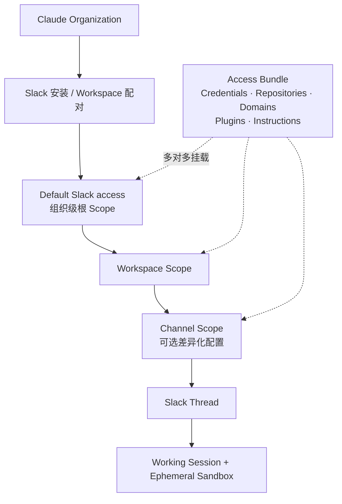

# Claude Tag 深度拆解（截图复核版）

> 研究快照：2026-08-12。本文优先使用 Anthropic 官方文档；真实产品截图用于补充界面和操作细节；YouTuber 解读仅作为架构假设来源，不作为 Anthropic 内部实现的证据。

## 1. 结论先行

Claude Tag 不是“为每个频道创建一个独立 Agent”，也不只是“把 Agent 接入 Slack”。更准确的产品模型是：

> Claude Tag = 一个组织级 Claude Agent + 分层 Scope 配置 + 可复用 Access Bundle + 每 Thread 一个工作 Session + 频道记忆与 Routine + 企业治理

Claude Managed Agents 主要解决任务如何在 Session、Sandbox、Tool Loop 中持续执行；Claude Tag 额外解决团队成员在哪个频道共同使用、该频道最终获得哪些能力、以谁的身份访问外部系统、什么上下文和记忆可以被读取，以及管理员如何控制成本与风险。

一个关键边界是：Claude Tag 的应用名、`@handle` 和头像在 Slack Workspace 间保持一致，当前不能按频道重命名或换成不同 Agent 形象。频道差异来自 Scope 解析，不来自独立的 `Team Agent Profile`。

## 2. 真实产品对象模型



这里包含五类不同对象：

| 对象 | 作用 | 生命周期 |
|---|---|---|
| Slack 安装 / 配对关系 | 让 Claude Organization 与一个 Slack Workspace 建立关联 | 管理员连接、断开 |
| Scope | 定义 Claude Tag 在组织根、Workspace 或 Channel 的有效配置 | 长期存在，可继承和覆盖 |
| Access Bundle | 可复用的能力与权限包，可同时挂到多个 Scope | 独立创建、复用、轮换 |
| Thread Session | 一个 Slack Thread 对应的一次多人协作任务 | Thread 创建，空闲后可恢复 |
| Memory / Routine | 频道长期知识与持续工作 | 按频道/Workspace 规则持久化 |

这五类对象不能合并成一个“Agent 配置”。尤其是 Access Bundle 与 Scope 是多对多关系，Session 又是 Scope 解析后的运行实例。

另外有三类对象使用独立规则：Budget Policy 位于 Usage 页面，以组织和频道为归因单位；Routine 是绑定频道的持久任务对象；`Open session in Claude` 是只读运行记录，不是第二个协作入口。

## 3. 完整产品流程

### 3.1 安装并配对 Slack Workspace

真实截图 01–03 展示了三步配对：

1. 在 Slack 安装 Claude App，并确认它可查看频道/Workspace 信息、在频道中执行动作。
2. 在要连接的 Workspace 中发送 `@Claude connect`。
3. 将 Claude 返回的配对码粘贴到 Claude 管理后台，并选择 Whole workspace 或 Specific channel。

配对解决的是 Claude Organization 与 Slack Workspace 的租户映射，不等于已经给 Claude 配置了 GitHub、Drive 等外部系统权限。

### 3.2 让 Claude 进入频道

- 公共频道中，Claude App 可被直接使用或添加。
- 私有频道中，如果 App 尚未被邀请，Slack 会提示 Claude 不在该频道；成员需要通过频道成员/Integrations 的 Add app 流程加入（截图 04–07）。
- 一个公开频道挂载高权限 Access Bundle 后，任何后来加入该频道的人都可能通过 Claude 使用这些权限，因此频道的加入策略本身就是权限边界。

### 3.3 配置组织根、Workspace 与 Channel Scope

管理后台的 Slack 树形结构是：

```text
Default Slack access
└── Workspace
    └── Channel
```

真实截图 09–15 显示三层 Scope 使用相似的配置面板，核心包括：

- Claude Tag version。
- Access bundles。
- Plugins。
- Custom instructions。
- Advanced：Default model、Environment、Auto mode allow rules、自动回复/访客等控制（具体项目会随版本变化）。

新增 Channel Scope 时，界面还要求或允许填写：

- Channel ID：从 Slack Channel 链接中取得。
- Name：后台显示名，可选。
- Description：供管理员理解 Scope 用途，可选。
- System prompt addendum：写入该频道的 Custom instructions。

频道被添加进配置树，不代表为它创建了一个新 Agent；它只是让该频道获得一个可单独设置的 Scope Overlay。

### 3.4 创建并复用 Access Bundle

Access Bundle 是 Claude Tag 权限架构的核心。截图 21–23 直接展示了 Bundle 内的五个页签：

| Bundle 内容 | 解决的问题 |
|---|---|
| Credentials / Connections | Claude 使用哪个服务账号/API Credential；每个 Connection 还可限定 Allowed hosts、URL path 与 HTTP method |
| Repositories | Claude GitHub App / GitLab 可访问哪些代码仓库 |
| Domains | Sandbox 可访问哪些无凭证 Host 与 Port；未被允许的网络请求会被阻断 |
| Plugins | 给连接附带工具使用方法或业务流程 Skill |
| Instructions | 与该能力包一起复用的指导，不绑定某个频道 |

Bundle 可以按能力拆分，例如 `data-readonly`、`github-write`、`monitoring`，然后在频道中组合，而不是每个频道重复配置 Credential。

官方当前已明确 Connection 的细粒度网络策略：凭证先绑定明确 Host，保存后还可按 URL Path 与 HTTP Method（例如只允许 `GET`、禁止 `DELETE`）继续收窄。Credential 由 Agent Proxy 在网络边界注入，模型和 Sandbox 不持有 Secret；Host 未命中 Connection、Bundle Domain 或 Environment 网络规则时，请求默认阻断。Web Search 发生在 Anthropic 服务端，不使用这三层 Sandbox allow 规则。

截图 24–26 还显示 GitHub 组织安装与个人连接入口。频道中的 GitHub 工作使用 Claude GitHub App；其他 SaaS 通常应使用专门为 Agent 创建的服务账号。个人 claude.ai Connector 只用于 DM，不会自动进入频道 Session。

### 3.5 在频道中启动和共同推进任务

1. 成员在频道中 `@Claude` 发起顶层消息。
2. Claude 在该 Thread 下创建 Working Session 和临时 Sandbox。
3. Thread 中显示接单、Checklist、运行状态以及 “Open session in Claude” 等入口；该 Web 页面只读，用于查看完整工作记录和工具调用。
4. 任何频道成员都可以在同一 Thread 中补充、纠偏或改变任务，无需再次 `@Claude`。
5. Claude 将结果、文件、PR 或链接回帖到原 Thread；所有补充、纠偏和继续执行仍在 Slack Thread 中完成。

截图 08、16–17、27、31、36–38 展示了这条链路。Web Session 界面能看到后台任务和工具过程，但这只能证明 Claude Tag 使用了与 Claude Code/Web Agent 高度接近的 Session 体验，不能据此断言它底层直接调用公开的 Managed Agents API。

### 3.6 记忆、Routine 与治理

- Channel Memory 可由频道成员通过自然语言写入和纠正；管理员可在后台按 Scope 查看文件，Owner 可编辑或删除（截图 28–30）。
- 真实界面中 Memory 以 Markdown 文件呈现，常见 `MEMORY.md` 作为索引，再链接到项目/约定的拆分文件。
- Routine 由成员在频道里用自然语言创建，归属某个 Channel Scope，并沿用该频道解析出的连接、指令、记忆和成本归属。
- Audit 页面实际包含 Scheduled work、Memory、Network events 三类，而不是一张完整的逐动作审计表；Network events 是可选的按小时 JSON 导出，且不包含 Git 与 MCP 流量。
- Usage 页面提供组织服务级支出、Spend limit 和频道用量入口（截图 18–19）。

## 4. 频道究竟差异化关联了什么

这是 Claude Tag 最核心、也最容易被错误抽象的部分。

### 4.1 Scope 解析规则

| 配置项 | Default Slack / Workspace / Channel 的合并方式 | 对运行的影响 |
|---|---|---|
| Access Bundles | 自上而下累加；Channel 获得 Root + Workspace + Channel 的并集 | 决定最终可用 Credential、Repo、Domain、Plugin、Instruction |
| 同 Host Credential / Connection rule | 最窄 Scope 胜出：Channel > Workspace > Default Slack；失败不回退；再受 Host/Path/Method 限制 | 决定 Agent 实际以哪个账号、哪些 API 入口访问服务 |
| Repositories | 所有生效 Bundle 的 Repo Grant 取并集 | 决定可读写代码范围 |
| Plugins | Bundle 内和 Scope 直挂的 Plugin 合并 | 决定 Session 获得的 Skill / 工具指导 |
| Bundle Instructions | 随 Bundle 一起进入所有绑定 Scope | 适合“能力携带的说明” |
| Custom instructions | 按 Default Slack → Workspace → Channel 顺序拼接，不互相替换 | 适合团队/频道约定；优先级高于 Channel Memory |
| Auto mode allow rules | 上层规则向下累加，Channel 只能增加更窄规则 | 预批准特定动作，但不是 Credential 权限本身 |
| Default model | 未设置则继承，Channel 可覆盖 Workspace；只影响新 Session | 既有 Thread 保持启动时模型，除非 Thread 内切换 |
| Environment | 未设置则继承组织默认，Scope 可固定共享 Environment | 决定 Sandbox、网络访问等级等执行条件 |
| Claude Tag version | 未设置则 Inherit，窄 Scope 可覆盖/关闭 | 控制该 Scope 使用 New、Legacy 或 Off |
| Respond automatically | 按 Scope 控制；频道成员在允许时也可修改频道值 | 决定是否必须 `@Claude` 才响应 |

最终不是简单的“Channel 覆盖 Workspace”，而是两类规则并存：

- 标量配置：继承后由更窄 Scope 覆盖，如模型、环境、版本。
- 集合配置：从上到下累加，如 Bundle、Repo、Plugin、Allow rule、Custom instructions；只有冲突 Credential 使用最窄 Scope 胜出。

后台的 Access Summary 正是 Effective Config Resolver 的可视化结果。截图 11–12 显示 Channel 同时拥有本级 `Tank Core` Bundle、一个继承 Bundle，以及解析后的全部 Repository 权限。

### 4.2 Memory 使用另一套拓扑

Memory 不按 Access Bundle 的组织根继承：

| Claude 工作位置 | 可读取 | 写入 |
|---|---|---|
| 公共频道 | Workspace Memory | 本频道笔记或 Workspace 共享内容，均位于 Workspace Store |
| 私有频道 | Workspace Memory（只读）+ 本私有频道 Memory | 私有频道自己的 Store |
| DM | 个人上下文/记忆 | 与团队频道隔离 |
| 其他 Workspace | 不可见 | 独立 Store |

因此不存在“组织级 Memory”。公共频道内容会在同一 Workspace 内共享；私有频道可以读取 Workspace 公共记忆，但不能把其私有信息写回公共 Workspace Store。

### 4.3 Thread 是配置快照与多人协作边界

- 新 Thread 启动时解析 Scope，固定本次 Session 的模型、Plugin、Skill、Instructions 等。
- 已运行 Thread 不会自动重载新 Plugin 或新 Instruction；应新开 Thread 验证。
- 后加 Credential 在旧 Thread 中可能已可调用，但 Claude 不会自动得知，需点名让它使用。
- 同一个 Thread 属于频道团队，任何参与者都可以 Steering。
- 每个 Thread 使用独立临时 Sandbox；持久化的是 Session 记录、Memory、Routine 和产物，不是常驻进程。

### 4.4 UI Atlas 中必须拆开的三条边界

1. **Scope 与预算分开**：Scope 解析模型、环境、Access Bundle、指令与交互策略；Usage 页面另行维护组织总限额、默认频道限额和单频道限额，未确认存在 Workspace Budget。
2. **Routine 与通用事件总线分开**：Claude Tag 已确认 Schedule、Channel Watch、PR Subscription；通用 Webhook / Event Trigger 只作为 Z Tag 扩展设计。
3. **协作入口与透明度入口分开**：Slack Thread 是唯一可 Steering 的协作面；Open session in Claude 仅提供只读 Trace，不能在 Web 中继续任务。

## 5. 用户与核心需求

| 用户 | 目标 | 关键产品能力 |
|---|---|---|
| 普通团队成员 | 不搬运上下文，直接把问题交给 Claude | 频道上下文、Thread Session、共享进度 |
| 项目/频道负责人 | 让 Claude 持续维护一个工作域 | Channel Memory、Routine、主动提醒 |
| IT / AI Owner | 配置 Claude 能做什么、在哪里能做 | Scope、Access Bundle、Environment、版本 |
| 外部系统管理员 | 为 Agent 创建最小权限账号 | Service Account、Repo Grant、Credential Rotation |
| 安全与合规 | 看清有效权限并能够撤销 | Access Summary、Agent Proxy、服务账号审计 |
| 财务与运营 | 控制成本并观察采用情况 | Spend limit、频道用量、告警 |

## 6. 场景分层

| 层级 | Agent 承担的工作 | 例子 | 关键依赖 |
|---|---|---|---|
| L1 理解频道 | 总结、检索、梳理 | 汇总本周决策、阻塞和待办 | Channel Context |
| L2 跨系统取数 | 查询资料和业务数据 | 结合 Drive、CRM、数仓回答 | Read-only Bundles |
| L3 执行动作 | 创建/修改外部对象 | 建工单、写文档、提交 PR | Agent Identity、Write Bundle |
| L4 持续负责 | 监听并主动处理 | 追审批、巡检告警、周期汇报 | Memory、Routine、Event Trigger |

截图 39–42 展示了日历/会议类端到端场景，但单凭视频画面无法确认会议加入、录制和转写分别由 Claude Tag、Google Workspace 连接还是其他演示组件完成，不能把具体机制写成已确认产品架构。

## 7. 技术架构：从频道事件到 Managed Agent

一次频道请求的典型链路应拆成：

1. Channel Adapter 接收 Mention、Thread Reply、消息编辑/删除和 App Event。
2. Tenant Resolver 解析 Claude Organization、Slack Workspace、Channel、Thread 和成员。
3. Scope Graph 找到 Default Slack、Workspace、Channel 的配置链。
4. Effective Config Resolver 按“覆盖、累加、拼接、冲突优先级”生成 `SessionLaunchSpec`；Interaction Policy 解析 Mention/Ambient 行为，Budget Policy 单独解析运行上限与归因。
5. Thread–Session Router 创建或恢复该 Thread 的 Managed Agent Session。
6. Context Service 注入 Thread、频道历史、文件与允许范围的 Workspace Memory。
7. Managed Agent 在临时 Sandbox 执行规划、代码、文件和 Tool Loop。
8. Agent Proxy 根据 Bundle 解析出的 Host/Path/Method 策略动态注入服务账号 Credential。
9. Event Bridge 将 Checklist、进度、确认和结果同步回 Slack Thread。
10. Memory、Routine、Usage 与 Audit 分别持久化，不与 Thread Session 混成一个 Store。

### 7.1 安全事实与建议分开

已确认的 Claude Tag 事实：

- Credential 不进入模型上下文和 Sandbox，由 Agent Proxy 在网络边界注入。
- 未命中 Connection、Domain 或 Environment 网络规则的 Host 默认不可达。
- Channel 中的外部操作使用 Agent 的 Service Account，而非请求者个人身份。
- GitHub PR 可链接回发起它的 Slack Thread，其他动作依赖对应服务账号的审计日志。

GLM 建议增强：

- 对写入、删除、发布、付款等高风险动作叠加请求者权限或即时审批。
- 建立统一 `人 → 消息 → Session → Tool Call → 外部对象` Ledger。Claude Tag 当前后台并未提供完整逐动作统一视图。
- 将 Effective Config 与来源 Scope 一起固化到 Session，支持事后解释“为什么这个频道当时有这项权限”。

## 8. Claude Tag 与 Managed Agent 的边界

| 能力 | 团队产品层（Tag / Z Tag） | 执行底座（Managed Agent） |
|---|---|---|
| 组织对象 | Organization、Workspace、Channel、Member | Agent Definition、Session、Run |
| 配置解析 | Scope Graph、Access Bundle Binding、Effective Config | 接收 SessionLaunchSpec 并执行 |
| 协作 | Thread 绑定、多人 Steering、渠道原生进度 | Steer、Interrupt、Event Stream |
| 上下文 | 频道历史、文件、成员与可见性 | Prompt、Session Context、Tool Result |
| 身份权限 | Agent Identity、Bundle、Scope、审批与审计 | Vault、Sandbox、Network Proxy 原语 |
| 长期状态 | Channel/Workspace Memory；Schedule、Channel Watch、PR Subscription | Memory Store、Cron/Webhook 原语 |
| 商业治理 | Spend limit、频道用量、RBAC | Session Budget、Runtime Trace |

因此，Managed Agent 是执行底座；Scope Graph、Access Bundle、Channel Memory、Thread 协作语义和组织治理才是团队级产品的主要增量。

## 9. 证据等级

| 等级 | 可用于什么结论 | 本仓库来源 |
|---|---|---|
| A 官方文档 | 产品边界、权限规则、生命周期、安全机制 | `docs/sources.md` |
| B 真实产品截图 | 界面字段、操作步骤、页面关系、可见状态 | `docs/claude-tag-screenshots.md` |
| C 三方解读 | 发现可讨论的架构假设 | `docs/claude-tag-third-party-analysis.md` |
| D UI 拆解项 | 作为 Z Tag 待设计清单，不能反推 Claude Tag 已上线 | `docs/claude-tag-ui-atlas.md` |

2026-08-12 再次核对官方设置地图与连接文档：Allowed hosts、URL path、HTTP method、Credential type 与 Environment 网络层均已被官方明确确认，不再标记为截图推断。

三方图中的 Redis、Vector DB、“stateful OS”、Entra Agent User、加密隔离等内容均没有被真实截图或官方资料直接确认，不能当作 Claude Tag 的既有技术实现。
