# Claude Tag 三方解读：可采纳与不可当作事实的部分

> 来源：[YouTube 解读视频](https://www.youtube.com/watch?v=UP95sD1ZA7I)。以下 13 张图是 YouTuber 自行绘制的分析，不是 Anthropic 官方架构图。

## 结论

这套解读对“问题分层”有参考价值，但对“Claude Tag 实际内部技术”做了大量无证据推演。

| 判断 | 可以使用的程度 | 说明 |
|---|---|---|
| Slack 原生多人协作、Thread 共享 Session | 可采纳 | 与真实截图和官方文档一致 |
| Runtime 与 Identity/治理解耦 | 可作为 GLM 架构原则 | 官方确认 Service Account、Agent Proxy、Sandbox，但未采用视频里的全部组件命名 |
| 异步任务、Checkpoint、恢复 | 方向可采纳 | 官方确认异步 Session、空闲恢复和 Routine，具体调度实现未公开 |
| Channel Memory 与 Thread Context 分离 | 可采纳 | 官方确认 Session、Channel/Workspace Memory 的边界 |
| Redis、Vector DB、“Stateful OS” | 不可当作事实 | 官方和截图未披露具体存储或 OS 架构 |
| “加密隔离频道 Memory” | 不可当作事实 | 官方描述权限隔离，没有披露视频所称的加密实现 |
| Entra Agent User 是 Claude Tag Identity Substrate | 不可当作事实 | 这是视频作者的企业身份参考方案，不是 Claude Tag 已确认实现 |
| Tokenless Auth | 不可当作事实 | Claude Tag 官方实际描述的是 Agent Proxy 在网络边界注入 Credential |
| Code Sandbox 被禁用、外部 API 需逐次 Admin Review | 不可泛化 | Claude Tag 使用 Sandbox；预批准与阻断由 Scope、Connection、Auto mode rules 等共同决定 |

## 对本项目有价值的三个抽象

1. **Interface / Collaboration Layer**：负责 Channel、Thread、多人 Steering 和进度回帖。
2. **Runtime Layer**：负责 Session、Sandbox、Tool Loop、异步执行与产物。
3. **Identity / Governance Layer**：负责 Service Account、Access Bundle、Agent Proxy、审批和审计。

本仓库的统一架构图沿用这三个问题域，但用真实产品对象替换了视频中的假想实现：

- 用 `Scope Graph + Effective Config Resolver` 替代笼统的“Channel Memory Runtime”。
- 用 `Access Bundle + Credential Ref + Agent Proxy` 替代“Entra Agent User / Tokenless Auth”。
- 用 `Thread–Session Binding + SessionLaunchSpec` 描述协作层与 Managed Agent 的接口。
- 将 Redis、Vector DB、Scheduler 内部数据结构留作实现选型，不写成已知事实。

## 原始分析图

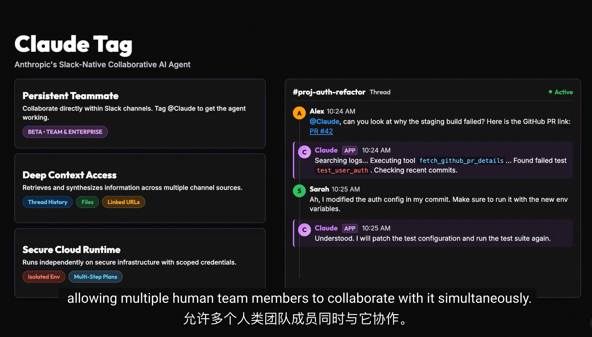

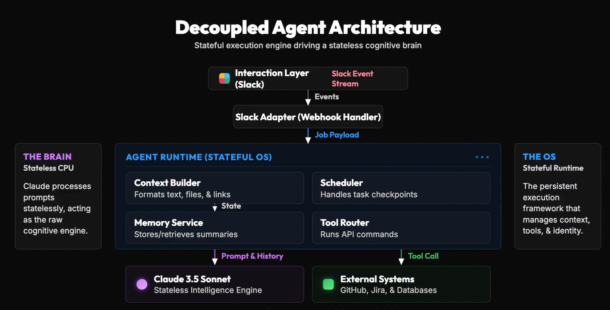

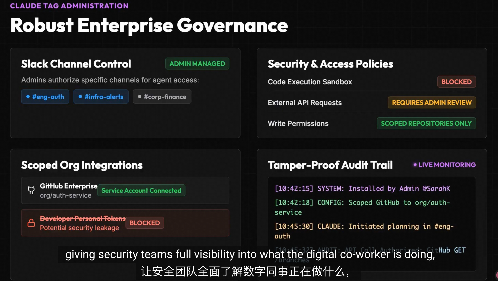

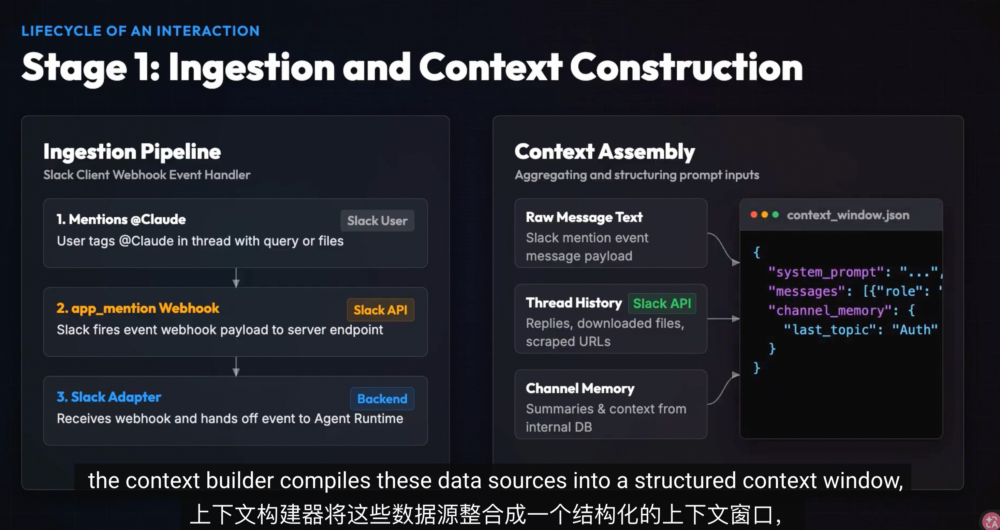

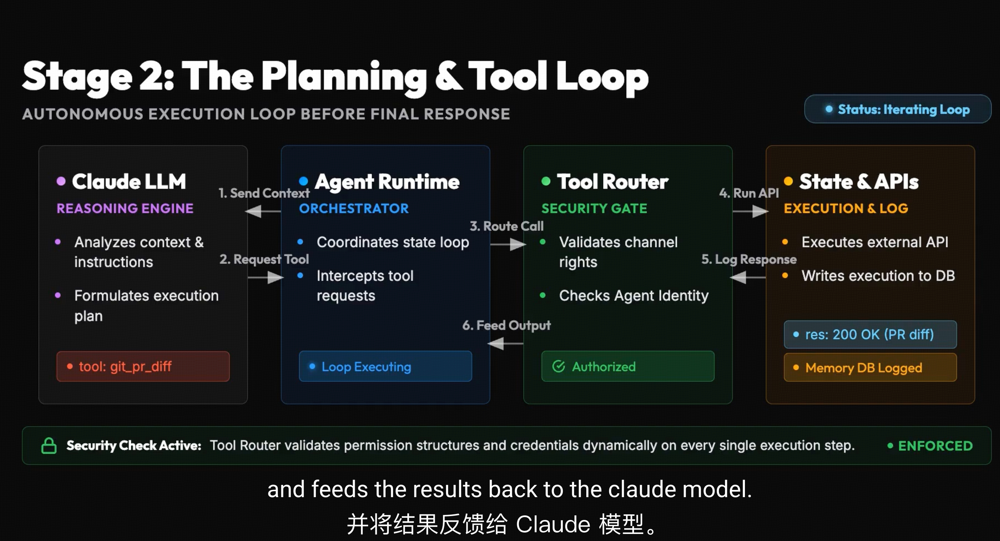

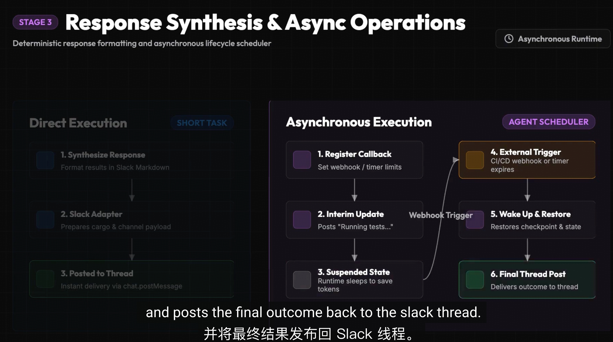

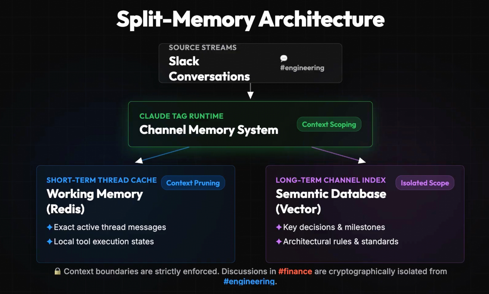

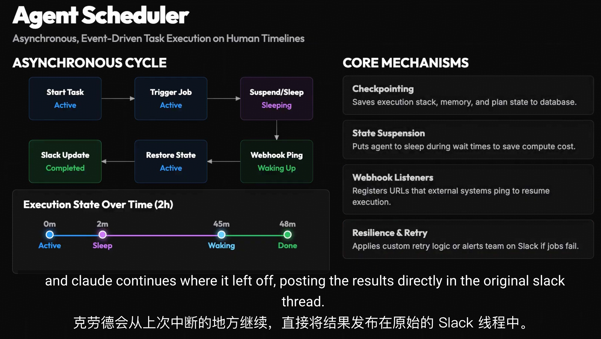

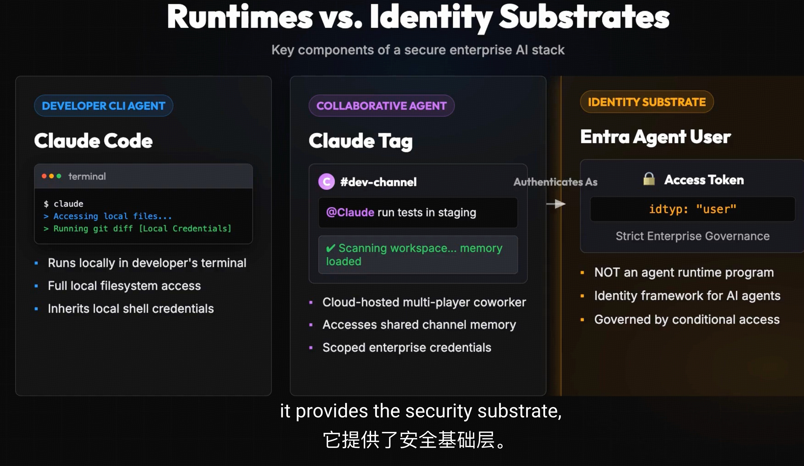

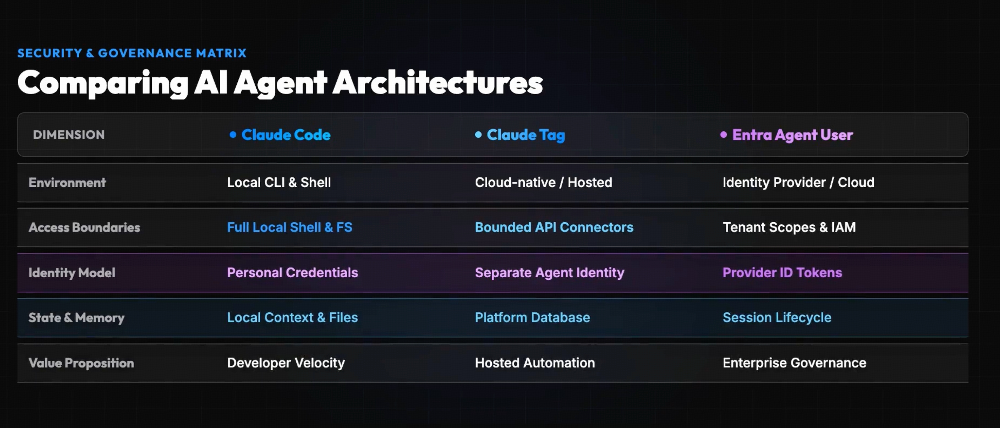

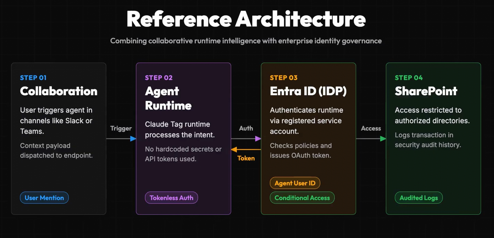

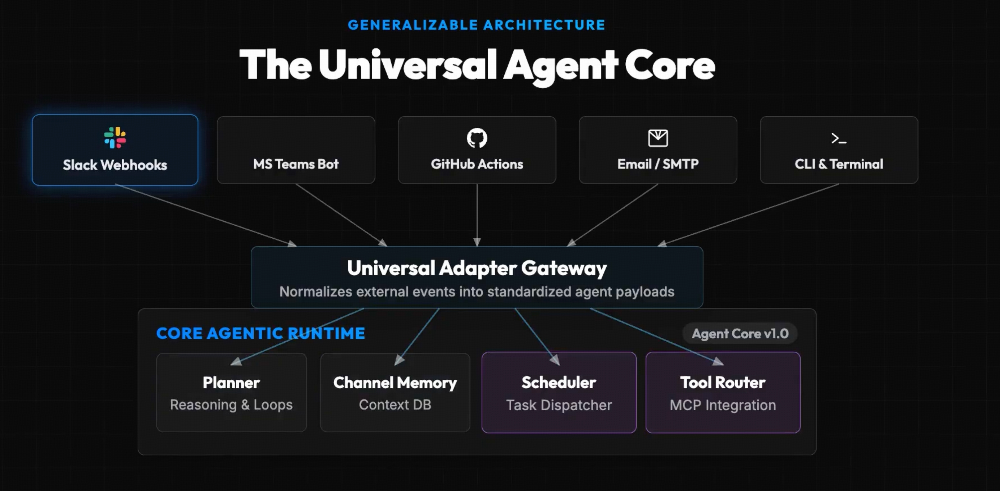

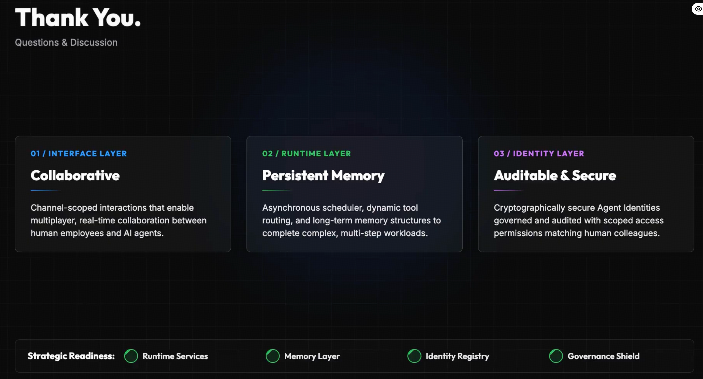
