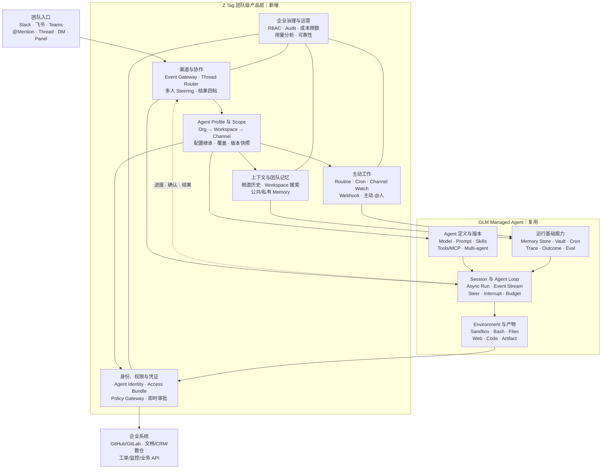
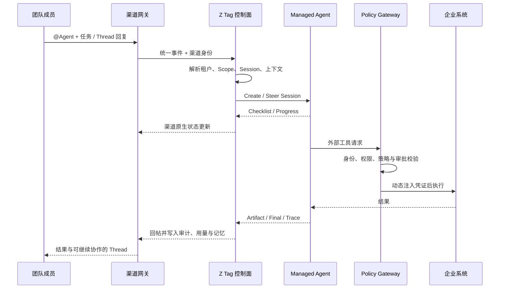

# 基于 GLM Managed Agent 构建 Z Tag

## 1. 建设假设

本方案假设 GLM Managed Agent 按 Claude Managed Agents 对标，已经或计划具备：Agent 定义与版本、长时间运行 Session、Event Stream、Steer / Interrupt、Sandbox、工具调用、Memory、Vault、定时部署、预算、结果评测和运行可观测性。

在此基础上，Z Tag 不重新实现 Agent Runtime，而是在其上构建团队协作、身份权限、上下文、治理和渠道产品层。

## 2. Managed Agent 可直接复用的能力

| 能力域 | 可复用能力 | Z Tag 的调用方式 |
|---|---|---|
| Agent 定义 | Model、Prompt、Tools / MCP、Skills、Multi-agent、版本 | Scope Engine 选择有效 Agent 版本 |
| Session / Agent Loop | 异步执行、SSE / Webhook、Steer、Interrupt、Budget | Thread Router 创建或恢复 Session |
| Environment | Sandbox、Bash、Files、Web、Code | 任务执行与产物生成 |
| Artifact | Session 文件、结构化输出、外部产物引用 | 结果卡片与频道回帖 |
| Memory 原语 | Memory Store、检索与写入接口 | 团队 Memory Service 按 Scope 编排 |
| Credential 原语 | Vault、Secret 管理、动态凭证 | Credential Gateway 受控注入 |
| Proactivity 原语 | Cron、Webhook、Scheduled Deployment | Routine Compiler 编译为运行任务 |
| Evaluation | Trace、Outcome、Eval / Backtest | 团队场景评测与持续优化 |

## 3. Managed Agent 之外必须补建

| 模块 | 为什么底座不够 | 推荐实现 | 优先级 |
|---|---|---|---|
| 渠道接入网关 | Runtime 不理解 Slack / 飞书 Thread | 统一 Channel Event Schema；首期飞书 / Slack Adapter | P0 |
| Thread–Session Router | Runtime 不知道多人在哪个 Thread 协作 | 持久化 `tenant/workspace/channel/thread/session` 映射 | P0 |
| 多人协作控制 | Session API 不等于多人协作体验 | 并发排序、Steer、Interrupt、编辑/删除语义 | P0 |
| Scope 配置引擎 | Agent 配置通常以 Agent / Session 为单位 | 组织→Workspace→Channel 继承、覆盖、版本快照 | P0 |
| Team Agent Profile | 频道需要稳定的 Agent 身份和职责 | 名称、头像、职责、指令、模型、Skill、环境、版本 | P0 |
| Team Agent Identity | Vault 只是 Credential 原语 | 服务账号、Access Bundle、频道归属、撤销与审计 | P0 |
| Credential / Policy Gateway | 仅存 Secret 无法阻止越权与外泄 | 默认拒绝出口；Host / Path / Method 白名单；动态注入 | P0 |
| 频道上下文服务 | Runtime 不知道频道历史和成员关系 | 历史抓取、搜索、置顶、文件、消息权限过滤 | P0 |
| 团队 Memory 拓扑 | Memory Store 不理解公共/私有频道边界 | Workspace Store + Channel Store + 来源和版本治理 | P0 / P1 |
| Routine 产品层 | Cron API 无法表达“监听频道、追 PR” | 自然语言 Routine → Cron / Webhook / Channel Watch | P1 |
| 结果呈现层 | Agent Event 不等于良好频道体验 | Checklist、卡片、文件、PR、Trace、主动 @人 | P0 |
| 管理后台 | Runtime Console 面向开发者 | 配对、频道配置、连接器、模型、Skill、试运行 | P0 |
| 企业治理 | Session 权限不是组织治理 | RBAC、访客/外部群策略、禁用、审批、保留策略 | P0 |
| 成本与用量 | Session Budget 不能代替组织额度 | Org / Workspace / Channel Ledger、硬限额、告警 | P0 |
| 全链路审计 | Runtime Trace 缺少团队发起链路 | 人→消息→Session→Tool Call→外部对象 | P0 |
| 可靠性控制 | 渠道与 Webhook 会重试、乱序 | 幂等、去重、状态对账、补偿、死信队列 | P0 |

## 4. 产品架构



## 5. 技术架构

### 5.1 核心服务

| 服务 | 核心职责 | 关键数据 |
|---|---|---|
| Channel Adapter | 渠道鉴权、事件转换、消息发送 | 原始事件、统一事件、回帖句柄 |
| Tenant Resolver | 解析租户、Workspace、Channel、用户 | 渠道安装关系、组织成员映射 |
| Scope Engine | 计算有效 Agent 配置并生成快照 | 配置树、覆盖规则、版本快照 |
| Thread Router | 创建、查找、恢复、终止 Session | Thread–Session 映射、状态、幂等键 |
| Context Service | 获取并裁剪频道、搜索、文件上下文 | 消息索引、权限标签、Context Pack |
| Team Memory Service | 按 Scope 管理读写、晋升、纠正、删除 | Memory、来源、可见域、版本 |
| Routine Service | 创建和编排定时、监听、订阅任务 | Trigger、Schedule、Cursor、Owner |
| Identity & Access | 解析 Agent 与请求者的有效权限 | Agent Identity、Access Bundle、RBAC |
| Policy Gateway | 控制网络出口、凭证注入和审批 | Egress Policy、Secret Ref、Approval |
| Event Bridge | 将运行事件转成渠道原生体验 | Checklist、Progress、Confirmation、Result |
| Usage Ledger | 按组织/频道/Agent/Session 计量 | Tokens、工具成本、预算、告警 |
| Audit Service | 还原完整的人—Agent—外部动作链路 | Actor、Message、Run、Tool、External Object |

### 5.2 请求时序



### 5.3 核心数据模型

```text
Tenant
├── Workspace
│   ├── Channel
│   │   ├── TeamAgentProfile
│   │   ├── ScopeConfigVersion
│   │   ├── ThreadSessionBinding
│   │   ├── ChannelMemory
│   │   └── Routine
│   └── WorkspaceMemory
├── AgentIdentity
├── AccessBundle
├── UsageBudget
└── AuditPolicy
```

`ThreadSessionBinding` 至少包含：

```text
tenant_id
workspace_id
channel_id
thread_id
agent_profile_id
managed_agent_session_id
effective_config_version
requester_id
status
last_event_cursor
created_at / updated_at / expires_at
```

## 6. 三个关键架构选择

### 6.1 共享 Agent Identity 采用混合权限模型

如果只按 Agent 服务账号权限执行，频道成员可能间接访问本人无权访问的数据。建议：

```text
实际可执行权限
= Agent Identity 权限
∩ Channel Scope
∩ 请求者权限（敏感操作）
∩ Runtime 风险策略
```

- 低风险读操作：可使用共享 Agent Identity。
- 写入、删除、发布、付款等操作：校验请求者权限或要求即时审批。
- 高敏数据：Agent Identity 和用户身份必须同时满足。

### 6.2 Session 与 Memory 解耦

- Thread Session：一次任务的连续协作。
- Channel Memory：频道长期偏好、决策和工作状态。
- Workspace Memory：跨公共频道可复用的组织知识。
- Skill / Knowledge Base：稳定、长篇、可审查的规则和方法。

不要把所有频道历史塞进永久 Session；这样会造成成本、污染、权限和可维护性问题。

### 6.3 Runtime Budget 与产品额度分层

- Managed Agent Budget：限制单次 Session 的执行时长、Token、工具和环境成本。
- Z Tag Org / Channel Limit：限制团队整体产品成本，并提供硬限额、预警和分摊。

两者需要分别计量，再在 Usage Ledger 中统一归集。

## 7. 建设分期

### Phase 0：团队可用闭环

目标：一个团队能在飞书或 Slack 频道内稳定地共同使用 Agent。

- Channel Adapter + 统一事件模型。
- Thread–Session Router + 多人 Steering。
- Team Agent Profile + Scope Engine。
- 频道上下文服务。
- Agent Identity、Access Bundle、Policy Gateway。
- Checklist、确认、结果回帖。
- RBAC、审计、基础用量和可靠性。

验收重点：任务串线率、重复执行率、Session 恢复成功率、权限拦截率、外部写操作可追溯率。

### Phase 1：持续负责

目标：Agent 从被动响应升级为持续维护工作。

- Workspace / Channel Memory 与治理。
- Routine：Cron、频道监听、Webhook、业务订阅。
- 主动 `@人`、阻塞跟踪和周期汇报。
- 频道级用量分析、预算和告警。
- 管理后台与试运行环境。

### Phase 2：平台化与规模化

目标：可复用地创建、发布和运营不同团队 Agent。

- Team Agent 模板和市场。
- 跨渠道统一 Agent Profile。
- 更细粒度的用户身份 Overlay 与 JIT Credential。
- 自动评测、问题诊断、Skill 改写、回测和回归。
- Agent / Skill / Routine 的灰度发布与效果分析。

## 8. 最终产品边界

> GLM Managed Agent 负责执行：模型、Session、Agent Loop、Sandbox、工具、Memory / Vault 原语和评测。

> Z Tag 负责团队产品：渠道、多人协作、Scope、团队上下文与记忆、Agent Identity、主动工作、企业治理和商业化。

