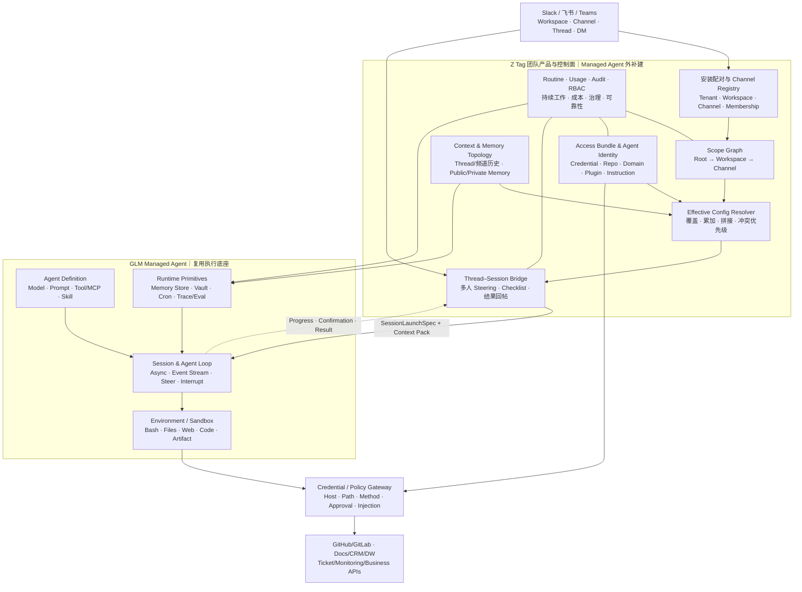
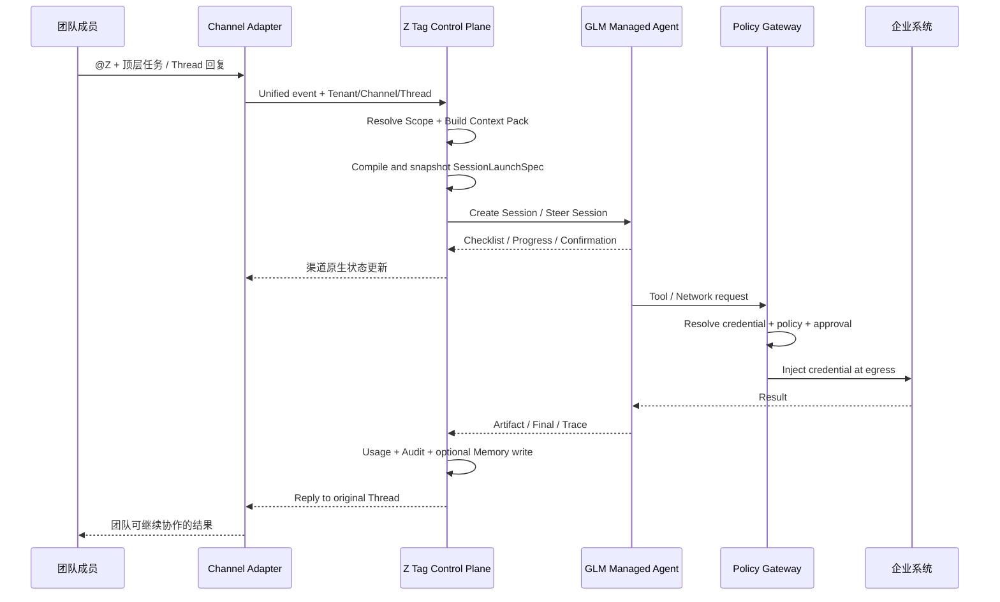

# 基于 GLM Managed Agent 构建 Z Tag（截图复核版）

## 1. 架构修正

上一版把频道抽象为 `Team Agent Profile`，容易让人理解成“每个频道创建一个独立 Agent”。根据真实产品截图和官方 Scope 规则，建议改成：

> 一个组织级 Z Tag Agent + Scope Graph + Access Bundle Binding + Effective Config Resolver + 每 Thread 一个 Managed Agent Session

频道不是 Agent 的容器，而是一个运行 Scope。频道差异由模型、环境、能力包、指令、自动动作规则、记忆与 Routine 共同解析得到。

这意味着 GLM Managed Agent 与 Z Tag 的接口也不应只是 `agent_id`，而应是一个版本化的 `SessionLaunchSpec`。

## 2. 建设假设

假设 GLM Managed Agent 已经或计划具备：

- Agent Definition 与版本。
- 异步/长时间运行 Session。
- Event Stream、Steer、Interrupt。
- 隔离 Sandbox、Bash、Files、Web、Code Execution。
- Tool / MCP / Skill 调用。
- Artifact 和结构化结果。
- Memory Store、Vault、Cron / Webhook 原语。
- Session Budget、Trace、Outcome / Eval。

这些能力可以“把一次任务做完”，但不会自动生成组织、Workspace、Channel、多人协作、权限继承和团队治理。

## 3. Managed Agent 外必须补建什么

| 模块 | 为什么不属于 Runtime 原语 | 怎么构建 | 优先级 |
|---|---|---|---|
| Channel Installation & Pairing | Runtime 不理解 Slack/飞书租户和 App 安装 | OAuth/安装回调、连接码、组织与 Workspace 映射、断开/重连 | P0 |
| Channel Registry | Runtime 不知道频道 ID、私密性、App Membership、外部共享状态 | 统一 Workspace/Channel 元数据与同步任务 | P0 |
| Thread–Session Bridge | Session ID 不等于渠道 Thread | 持久化 Thread Binding、幂等创建、Steer/Interrupt、恢复与回帖句柄 | P0 |
| Scope Graph | Agent 配置不是组织→Workspace→Channel 的配置树 | Root/Workspace/Channel 节点、父子关系、版本和变更审计 | P0 |
| Effective Config Resolver | 不同字段的继承规则不同 | 标量覆盖、集合累加、指令拼接、Credential 冲突优先级、配置快照 | P0 |
| Access Bundle Registry | Vault Secret 不等于可复用权限包 | Bundle 组合 Credential、Repo、Domain、Plugin、Instruction；多 Scope 绑定 | P0 |
| Agent Identity Registry | 个人 Token 不能作为团队 Agent 身份 | 每外部系统独立 Service Account、GitHub App、Credential Ref、轮换/撤销 | P0 |
| Credential / Network Proxy | Sandbox 内存 Secret 无法防止泄漏和越权 | Host/Path/Method 策略、网络边界动态注入、默认拒绝、事件记录 | P0 |
| Channel Context Service | Runtime 不知道 Thread/频道历史与成员可见性 | 拉取、索引、裁剪、文件解析、权限标签和 Context Pack | P0 |
| Team Memory Topology | Memory Store 不知道公共/私有频道规则 | Workspace Store、Private Channel Store、Markdown 文件、来源/编辑/删除 | P1 |
| Channel Interaction Renderer | Agent Event 不等于渠道原生体验 | 接单、Checklist、状态、确认、文件/PR 卡片、Session 深链、主动 @人 | P0 |
| Routine Product Layer | Cron 不能表达“本频道持续追这件事” | 自然语言创建 Trigger，绑定 Channel Scope、Cursor、Owner 和有效权限 | P1 |
| Governance Console | Runtime Console 面向开发者，不理解团队 Scope | 配对向导、Scope 树、Bundle 库、Access Summary、Memory/Routine/Usage | P0/P1 |
| Usage & Spend Control | Session Budget 无法限制组织产品消费 | Org 总额度、Channel 分摊、硬限额、预警、Usage Credit | P0 |
| Unified Audit Ledger | Runtime Trace 缺少渠道发起人和外部对象 | Message→Session→Tool→External Object 统一事件关联；外部日志回链 | P1 |
| Channel Reliability | Slack/飞书 Event 会重试、乱序和丢回调 | Event ID 幂等、Outbox、Cursor、补偿、死信、状态对账 | P0 |

## 4. Z Tag 产品架构

### 4.1 六个产品面

| 产品面 | 主要用户 | 核心能力 |
|---|---|---|
| 安装与配对 | Owner / IT | 连接 Claude Organization 与 Slack/飞书 Workspace，检查权限和频道状态 |
| Access Bundle Library | Owner / 系统管理员 | 创建、复用、轮换 Credential/Repo/Domain/Plugin/Instruction 组合 |
| Scope Console | Owner / Admin | 配置 Root、Workspace、Channel，查看继承来源、差异和 Effective Access |
| Channel Experience | 团队成员 | `@Agent`、Thread 多人协作、Checklist、Steer、结果回帖、Configure |
| Memory & Routine | 频道成员 / Owner | 自然语言维护长期记忆和持续工作，后台查看/编辑/停用 |
| Governance & Usage | 安全 / 财务 / 运营 | 权限、审计、Spend limit、频道用量、告警和可靠性 |

### 4.2 不建议把“自定义 Agent”混进第一版

如果严格对标 Claude Tag，第一版应提供一个统一的 Z Tag Agent，由 Scope 决定不同频道的能力与行为。名称、头像、角色模板、多个 Agent 实例属于 Z Tag 的扩展产品方向，不应成为 Scope/权限底座的前置依赖。

后续若支持一个频道挂多个 Agent，也应复用同一套结构：

```text
ChannelScope + AgentDefinitionRef + BundleBindings + InstructionOverlay
```

而不是为每个 Agent 复制一套 Connector、Memory、Audit 和渠道网关。

## 5. 统一架构



## 6. Scope 与 Effective Config Resolver

### 6.1 Scope 数据结构

```text
Scope
├── id
├── tenant_id
├── type: ROOT | WORKSPACE | CHANNEL
├── parent_scope_id
├── channel_installation_id
├── external_workspace_id
├── external_channel_id
├── display_name / description
├── scalar_config_version
└── status
```

Scope 自身不保存 Credential 内容，只保存 Bundle Binding 和本级行为配置。

### 6.2 四种解析语义

| 语义 | 适用字段 | 算法 |
|---|---|---|
| Last non-null wins | Tag version、Default model、Environment、自动回复等 | 从 Root 到 Channel 扫描，最后一个显式值生效 |
| Additive union | Access Bundle、Repository、Plugin、Domain、Allow rule | Root + Workspace + Channel 去重合并 |
| Ordered concat | Scope Custom Instructions、Bundle Instructions | 依层级和来源稳定排序后拼接，保留 Provenance |
| Narrowest wins on conflict | 同 Host Credential / Network rule | Channel > Workspace > Root；同 Scope 冲突直接报错或强告警 |

### 6.3 Resolver 输出

```text
SessionLaunchSpec
├── agent_definition_ref
├── effective_model
├── environment_ref
├── plugin_and_skill_refs[]
├── repository_grants[]
├── domain_allow_rules[]
├── credential_route_rules[]
├── ordered_instructions[]
├── auto_mode_allow_rules[]
├── memory_read_scopes[]
├── memory_write_scope
├── session_budget
├── interaction_policy
├── source_scope_versions[]
└── spec_hash
```

必须保留每个结果的来源 Scope 和版本。管理后台的 Access Summary 应支持展开为：

```text
GitHub / repo-a
← engineering-write bundle
← #platform channel scope
```

这样管理员才能解释“这个频道为什么有这项权限”。

### 6.4 配置何时生效

- 新 Thread：使用最新 Effective Config 创建 Session。
- 已有 Thread：保持启动时的 Model、Plugin、Skill、Instruction 快照。
- Credential 轮换/撤销：安全变更应立即作用于所有 Session，不被旧快照固化。
- 新增 Connection：可立即通过 Proxy 生效，但 Agent 的工具认知可能需要新 Thread 或显式提示。

## 7. Access Bundle 与 Agent Identity

### 7.1 Bundle 模型

```text
AccessBundle
├── name / description / version
├── credential_refs[]
├── repository_grants[]
├── domain_rules[]
├── plugin_refs[]
├── bundle_instructions[]
└── scope_bindings[]
```

Bundle 应按能力命名和复用，例如：

- `data-readonly`
- `github-write-staging`
- `monitoring-prod-read`
- `salesforce-account-read`

Scope Console 只负责“绑定哪些 Bundle”，Credential 的创建、轮换和外部权限范围在 Bundle/Identity 管理中完成。

### 7.2 Agent Identity 模型

Claude Tag 的 Agent Identity 不是一个万能 Token，而是一组外部身份：Slack App、GitHub App、Google 虚拟用户、Datadog Service Account 等。

Z Tag 建议：

```text
AgentIdentity
└── ServicePrincipal[system]
    ├── external_account_id
    ├── credential_ref
    ├── allowed_hosts / paths / methods
    ├── external_role / resource_scope
    ├── rotation_policy
    └── audit_attribution
```

Credential 只存在 Vault/Proxy，不进入模型上下文或 Sandbox。

## 8. Channel Context、Memory 与 Session 必须分离

### 8.1 Context Pack

每次请求动态构建：

- 当前 Thread 全量或裁剪消息。
- 当前频道近期历史、置顶、文件和链接。
- 可选 Workspace 搜索结果。
- 按隐私规则读取的 Memory 文件。
- 请求者、频道成员和权限标签。

### 8.2 Memory 拓扑

```text
WorkspaceMemoryStore
├── public-channel notes / shared facts
└── Channel indexes

PrivateChannelMemoryStore[channel_id]
└── private notes only
```

规则：

- 公共频道读写 Workspace Store，可保留 Channel 来源。
- 私有频道只读 Workspace 公共内容，写入独立 Private Store。
- 不建立组织级共享 Memory。
- DM 使用个人 Store，不复用团队 Bundle 或团队 Memory。
- Memory 用于短小稳定事实；长 Playbook 放 Repo/Knowledge Base/Skill。

### 8.3 Thread Session

`ThreadSessionBinding` 至少包含：

```text
tenant_id
installation_id
workspace_id
channel_id
thread_id
managed_agent_session_id
session_launch_spec_hash
requester_id
participant_ids[]
status
last_channel_event_cursor
last_runtime_event_cursor
created_at / updated_at / expires_at
```

Session 负责一次任务连续协作；Memory 负责跨 Session 的频道长期状态。不要把频道所有历史塞入一个永久 Session。

## 9. 核心技术服务

| 服务 | 核心职责 | 关键数据/输出 |
|---|---|---|
| Channel Adapter | 渠道鉴权、事件转换、消息发送 | UnifiedChannelEvent、ReplyHandle |
| Installation Service | App 安装、连接码、Workspace 配对 | Installation、Tenant Mapping |
| Channel Registry | Workspace/Channel/Member 同步 | Privacy、Membership、External Share |
| Scope Graph Service | 配置树、版本、Bundle Binding | ScopeVersion、Binding |
| Effective Config Resolver | 计算并解释最终运行配置 | SessionLaunchSpec、Provenance、Diff |
| Access Bundle Service | 资源包创建、复用、轮换 | BundleVersion、CredentialRef、RepoGrant |
| Thread–Session Bridge | Session 创建/恢复/Steer 与幂等 | ThreadSessionBinding、Event Cursor |
| Context Service | 构建 Thread/Channel/Workspace 上下文 | ContextPack、Permission Labels |
| Team Memory Service | 文件化记忆、读写拓扑和治理 | MemoryFile、Store、Source、Version |
| Routine Service | 定时、监听、订阅和持续跟进 | Trigger、Schedule、Cursor、Owner |
| Interaction Renderer | 渠道 Checklist、确认、Artifact、深链 | Channel Message State |
| Policy Gateway | 网络出口、凭证注入、审批 | RouteRule、Approval、NetworkEvent |
| Usage Ledger | 组织/频道/Session 计量 | Spend、Budget、Alert |
| Audit Ledger | 关联发起人、Session、Tool 与外部动作 | Trace Link、External Object、Attribution |

## 10. 请求时序



## 11. 权限模型：对标与增强分开

### 11.1 Claude Tag 当前模式

频道内使用 Agent Service Account。任何频道成员都可以让 Claude 使用该频道解析出的权限；并不天然要求请求者本人也拥有外部系统权限。

### 11.2 GLM 建议的混合模式

```text
Effective Action Permission
= Agent Identity permission
∩ Effective Channel Scope
∩ Runtime policy
∩ Requester/JIT approval（仅敏感动作）
```

- 低风险读取：可直接使用共享 Agent Identity。
- 写入、删除、发布：校验请求者权限或即时审批。
- 高敏数据：Agent Identity 与请求者授权双重满足。
- Routine：记录创建者，但运行时仍使用频道当前有效权限；权限撤销应立即停止后续运行。

这属于 Z Tag 的增强设计，不应写成 Claude Tag 已有事实。

## 12. 治理与审计的真实缺口

Claude Tag 后台当前明确提供 Scheduled work、Memory、Network events；逐动作归因还分散在 Slack Thread、GitHub 回链与各外部 Service Account 日志。

Z Tag 应补建统一 Audit Ledger：

```text
Human actor
→ Channel message
→ Effective config snapshot
→ Managed Agent session
→ Tool/network action
→ Credential route
→ External object
→ Result message
```

它既是安全能力，也是问题诊断和效果评测的基础数据资产。

## 13. 建设分期

### Phase 0：频道内可共同完成任务

- Slack/飞书 Installation + Channel Registry。
- Root/Workspace/Channel Scope Graph。
- Access Bundle + Agent Identity + Policy Gateway。
- Effective Config Resolver + Access Summary。
- Thread–Session Bridge + Checklist/Result Renderer。
- Channel Context、基础 RBAC、Usage、幂等和补偿。

验收指标：重复执行率、Thread 串线率、Session 恢复成功率、配置解析正确率、权限拦截率、回帖成功率。

### Phase 1：持续负责且可治理

- Public/Private Memory Topology 与文件治理。
- Routine：Cron、Channel Watch、Webhook、业务订阅。
- 主动 @人、阻塞跟踪、周期汇报。
- 统一 Audit Ledger、Channel Usage、Spend limit、告警。
- Channel Configure 页面与成员可编辑边界。

### Phase 2：平台化扩展

- 多 Agent Definition 与频道挂载，但复用同一 Scope/Bundle 底座。
- Agent/Bundle/Scope 模板与市场。
- User Overlay、JIT Credential、细粒度审批。
- Eval→诊断→Skill 改写→回测→回归闭环。
- Scope、Bundle、Skill、Routine 灰度发布与效果分析。

## 14. 最终产品边界

> GLM Managed Agent 负责：Session、Agent Loop、Sandbox、Tool、Artifact、Memory/Vault/Cron 等运行原语。

> Z Tag 负责：渠道安装、Scope Graph、Access Bundle、Agent Identity、Effective Config、Thread 多人协作、团队 Context/Memory、Routine、治理和商业化。
